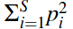
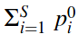
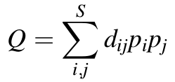
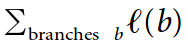
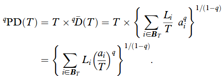

---
title: "DIVERSITY indices : abundance"
date: "21/02/2018"
output:
  html_document:
    number_sections: no
    toc: yes
    toc_float:
      collapsed: false
      smooth_scroll: false
---	


```{r, echo=FALSE}
library(knitr)
```

<br/>
<br/>

# Standard diversity indices

## 1949 : Simpson (Nature)

**Simpson concentration :** probability that two randomly chosen individuals from a given community are the same species.

<!-- <div style="text-align:center"></div>   -->
```{r, echo=FALSE, fig.align='center', out.width='60px', fig.retina=1}

```

<!-- \begin{equation} -->
<!-- \sum\limits_{i=1}^S {p_i}^2 -->
<!-- \end{equation} -->

<br/>

**Gini-Simpson index :**  probability that two randomly chosen individuals from a given community are different species.

<!-- <div style="text-align:center"></div>   -->
```{r, echo=FALSE, fig.align='center', out.width='80px', fig.retina=1}
include_graphics("pictures_tutorials/formula_Gini-Simpson-index.png")
```

<br/>

## 1948-1962 : Shannon & Weaver

**Shannon entropy :**  average amount of *information* in the community, given the facts that :

- rare species carry more *information* than common species ;
- their information value is proportional to the logarithm of their relative abundance.

<!-- <div style="text-align:center"></div>   -->
```{r, echo=FALSE, fig.align='center', out.width='100px', fig.retina=1}
include_graphics("pictures_tutorials/formula_Shannon-entropy.png")
```

<br/>

Measures the loss of information due to the loss of a species.  
Or the uncertainty about the species obtained when one individual is randomly chosen.

<br/>

## 1961-1970 : Rényi

**Rényi entropy :**

- `q -> 0` : increasingly weighs all possible species more equally, regardless of their probabilities.
- `q = 0` : Hartley entropy (logarithm of the species richness).
- `q -> 1` : Shannon entropy.
- `q -> inf` : increasingly determined by the most abundant species.

<!-- <div style="text-align:center"></div>   -->
```{r, echo=FALSE, fig.align='center', out.width='160px', fig.retina=1}
include_graphics("pictures_tutorials/formula_Renyi-entropy.png")
```

<br/>


# Hill's numbers

## 1973 : Hill (Ecology)

<br/>
The **"doubling" property** = if two equally large, completely distinct communities (no shared species) each have diversity X, and if these communities are combined, then the diversity of the combined communities should be 2X.

**Most raw diversity indices (standard diversity indices, `H`) do not obey this property,  
but their numbers equivalents do.**

<br/>

The **numbers equivalents** or **effective number of elements** of a diversity index = number of equally likely elements needed to produce the given value of the diversity index.  
*The diversity of `S` equally abundant species is `S`.*

Every diversity measure `H` has a number equivalent `D` :
<!-- <div style="text-align:center"></div>   -->
```{r, echo=FALSE, fig.align='center', out.width='300px', fig.retina=1}
include_graphics("pictures_tutorials/formula_Hill-numbers.png")
```

<br/>
The order `q` determines a diversity **measure’s sensitivity to species abundance** (rare or common species) :

- orders higher than 1 are disproportionately sensitive to the most common species,
- while orders lower than 1 are disproportionately sensitive to the rare species.

<br/>

|        | q = 0 | q = 1 | q = 2 |
|--------------------------|--------------------------|--------------------------|--------------------------|
| *Standard diversity indices*  | Species richness <br/>     | Shannon entropy <br/>     | Simpson index <br/>  <br/><br/> Gini-Simpson index <br/>    |
| *- Effective numbers <br/> Hill numbers* <br/> *- exp(Rényi entropy) <br/>(total dissimilarity)* | Species richness    | Exponential of Shannon entropy     |  Inverse of (Gini)-Simpson index  |
|        |  |  |  |


<br/>

# Similarity-sensitive measures

## 1982 : Rao (Theoretical Population Biology)

**Rao's quadratic entropy :**

- measure of average conflict among species  
- efficient index of functional diversity  
- expected dissimilarity between two individuals of a given species assemblage selected at random with replacement
- **Simpson concentration + pairwise distance between species**

<!-- <div style="text-align:center"></div>   -->
```{r, echo=FALSE, fig.align='center', out.width='150px', fig.retina=1}

```

*Both Simpson and Rao indices :*

- non-linearity with respect to increasing diversity
- do not obey the replication principle

<br/>

## 1992 : Faith (Biological Conservation)

**Phylogenetic diversity (PD)** = sum of the lengths of all those branches that are members of the corresponding minimum spanning path (smallest assemblage of branches from the cladogram for the complete set of taxa such that, for any two members of a subset of the taxa, a path connecting the two can be found that uses only branches in the assemblage).

<!-- <div style="text-align:center"></div>   -->
```{r, echo=FALSE, fig.align='center', out.width='150px', fig.retina=1}

```

<br/>

## 2009 : Allen (American Naturalist)

**Phylogenetic entropy index :**

- places a high value on distinctive species but has the property that when members of a species become rare in proportion to other species, it is never desirable to eliminate them  
- **Shannon entropy + phylogenetic differences**

<!-- <div style="text-align:center"></div>   -->
```{r, echo=FALSE, fig.align='center', out.width='300px', fig.retina=1}
include_graphics("pictures_tutorials/formula_Allen-entropy.png")
```

*Both Shannon and Allen indices :*

- non-linearity with respect to increasing diversity
- do not obey the replication principle

<br/>

## Generalization

<br/>

|        | q = 0 | q = 1 | q = 2 |
|--------------------------|--------------------------|--------------------------|--------------------------|
| *Standard diversity indices*  | Species richness <br/>     | Shannon entropy <br/>     | Simpson concentration <br/>  <br/><br/> Gini-Simpson index <br/>    |
| *- Effective numbers <br/> Hill numbers* <br/> *- exp(Rényi entropy) <br/>(total dissimilarity)* | Species richness    | Exponential of Shannon entropy     |  Inverse of Simpson concentration  |
| *Generalization* <br/> *Similarity information* | Faith PD (ultrametric tree)    |   Allen's entropy <br/> Generalization of Shannon entropy   |  Rao's quadratic entropy <br/> Generalization of Gini-Simpson index |
|        |  |  |  |

<br/>


# Hill numbers' + similarity-sensitive measures

Improve the formula of Hill numbers by adding a **similarity-sensitive** parameter = measure that reflect the varying dissimilarities between species (number specifying how similar they are).

<br/>

[//]: <> (2006 : Ricotta & Szeidl (Theoretical Population Biology))

## 2010 : Chao (Phil. Trans. R. Soc.)

Family of effective number similarity-sensitive measures, **tailored specifically to phylogenetic diversity** (similarity derived from a tree = **distance**).

**Mean phylogenetic diversity of order `q` :**

- family of diversity measures taking into account phylogenetic similarities, derived from a phylogenetic tree.
- product of the interval duration `T` and the mean diversity over that interval.

<br/>

**Phylogenetic diversity of order `q` through `T` years ago :**

<!-- <div style="text-align:center"></div>   -->
```{r, echo=FALSE, fig.align='center', out.width='350px', fig.retina=1}

```

with :

- `Li` = length of branch `i`
- `ai` = total abundance descended from branch `i`
- `q` = sensitivity parameter

- `T` = `sum(Li * ai)` if ultrametric tree  
      = `mean quantity` if non-ultrametric tree

<br/>
*Hill numbers* = special case for all species maximally distinct, all branch lengths = `T`

*Faith's PD for all `q`* = all species maximally distinct and equally common, age of the highest node = `T`

After applying a simple transformation, the phylogenetic diversity measure of Faith (1992) and the phylogenetic entropy of Allen et al. (2009) are special cases of mean phylogenetic diversity.

<br/>

**Properties of values of Chao model :**

- satisfies replication, but only under the assumption that *subcommunities all have the same mean evolutionary change (ultrametric tree)*
- for *non-ultrametric trees*, mean phylogenetic diversity can be greater than the number of species !

<br/>

## 2012 : Leinster (Ecology)

<br/>
*Community’s diversity profile* = calculate the diversity of order q for every q, and plot it against q.

For `q != 1` :

<!-- <div style="text-align:center"></div>   -->
```{r, echo=FALSE, fig.align='center', out.width='250px', fig.retina=1}
include_graphics("pictures_tutorials/formula_Leinster-numbers.png")
```

with :

- `pi` = relative abundances
- `Z` = matrix of similarities between species ( 0 = total dissimilarity)
- `q` = sensitivity parameter

- `(Zp)i` = relative abundance of species similar to the ith  
          = expected similarity between and individual of the ith species and an individual chosen at random  
          = measures the ordinariness of the ith species within the community  
          = inversely related to the diversity

<br/>
*Hill numbers* = special case of **total dissimilarity**, `Z` = identity matrix, `(Zp)i` = `pi`

**If a measure knows nothing of the commonalities between species, it will evaluate the community as more diverse than it really is. The naive model typically overestimates diversity.**

<br/>

|        | q = 0 | q = 1 | q = 2 |
|--------------------------|--------------------------|--------------------------|--------------------------|
| *Standard diversity indices*  | Species richness <br/>     | Shannon entropy <br/>     | Simpson concentration <br/>  <br/><br/> Gini-Simpson index <br/>    |
| *- Effective numbers <br/> Hill numbers* <br/> *- Leinster naive model <br/> exp(Rényi entropy) <br/> (total dissimilarity)* | Species richness    | Exponential of Shannon entropy     |  Inverse of Simpson concentration  |
| *Generalization* <br/> *Similarity information* | Faith PD (ultrametric tree)    |   Allen's entropy <br/> Generalization of Shannon entropy   |  Rao's quadratic entropy <br/> Generalization of Gini-Simpson index |
| *- Leinster model <br/> exp(Rényi entropy) <br/> Similarity information* | Faith PD (ultrametric tree)    |      |  1 / (1 - Rao's quadratic entropy) |
|        |  |  |  |


**Properties of values of Leinster model :**

- *Partitioning properties :*
      - Effective number : diversity of a community with equally abundant and totally dissimilar species  = species richness
      - Modularity : partition in subcommunities
      - Replication : if subcommunities of equal size and diversity, diversity = nb subcom * subdiv
- *Elementary properties :*
      - Symmetry
      - Absent species
      - Identical species
- *Effect of species similarity on diversity :*
      - Monotonicity
      - Naive model
      - Range

**Note :** Allen and Rao's entropies do not respect the replication principle.


<br/>
<br/>


# Glossary

- **Ultrametric tree** = in which the distances from the root to every branch tip are equal  
                  = if the branch lengths are proportional to divergence time, all branch tips are the same distance from the tree base (first node)
                  = a) on the graph, b) is non-ultrametric
                  
<!-- <div style="text-align:center"></div>   -->
```{r, echo=FALSE, fig.align='center', out.width='600px', fig.retina=1}
include_graphics("pictures_tutorials/example_ultrametric-tree.png")
```

<br/>
<br/>


# Citations

- Allen, B., Kon, M., Bar‐Yam, Y., Associate Editor: Ross H. Crozier, & Editor: Monica A. Geber. (2009). A New Phylogenetic Diversity Measure Generalizing the Shannon Index and Its Application to Phyllostomid Bats. The American Naturalist, 174(2), 236-243. https://doi.org/10.1086/600101
- Chao, A., Chiu, C., & Jost, L. (2010). Phylogenetic diversity measures based on Hill numbers. Philosophical Transactions: Biological Sciences, 365(1558), 3599-3609. http://www.jstor.org/stable/20789175
- Faith, D. (1992). Conservation evaluation and phylogenetic diversity. Biological Conservation. 61. 1-10. https://doi.org/10.1016/0006-3207(92)91201-3
- Hill, M. (1973). Diversity and Evenness: A Unifying Notation and Its Consequences. Ecology, 54(2), 427-432. https://doi.org/10.2307/1934352
- Leinster, T., & Cobbold, C. (2012). Measuring diversity: The importance of species similarity. Ecology, 93(3), 477-489. http://www.jstor.org/stable/23143936
- Rao, C. R. (1982). Diversity and Dissimilarity Coefficients: A Unified Approach. Theoretical population biology, 21, 24-43. Theoretical Population Biology. 21. 24-43. https://doi.org/10.1016/0040-5809(82)90004-1
- Rényi, Alfréd. On Measures of Entropy and Information. Proceedings of the Fourth Berkeley Symposium on Mathematical Statistics and Probability, Volume 1: Contributions to the Theory of Statistics, 547--561, University of California Press, Berkeley, Calif., 1961. https://projecteuclid.org/euclid.bsmsp/1200512181
- Shannon, C. E. (1948), A Mathematical Theory of Communication. Bell System Technical Journal, 27: 379–423. https://doi.org/10.1002/j.1538-7305.1948.tb01338.x
- Simpson, E. H. 1949 - Measurement of diversity. Nature 163: 688. https://doi.org/10.1038/163688a0

