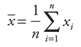
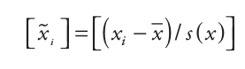
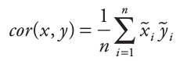
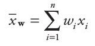
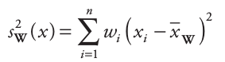
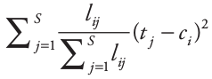

---
title: "DIVERSITY indices : communities"
date: "02/03/2018"
output:
  html_document:
    number_sections: no
    toc: yes
    toc_float:
      collapsed: false
      smooth_scroll: false
---	

  

# Glossary {.tabset .tabset-fade .tabset-pills} 

## Formulas

- **Mean :** 
- **Variance :** 

- **Standardization :** 
- **Correlation :** 

 
 

## Formulas with weights

- **Weighted mean :**  if weights sum to 1
- **Weighted variance :**  if weights sum to 1

- **Weighted standardization :** 
- **Weighted correlation :** 
- **Weighted covariance :** 

 
 

# 

## 2016 : Peres-Neto

### Community Weighted Mean (CWM)

CWM (for one community site) = 
  

with :

- `xi` = trait value of species i
- `wi` = abundance of species i
- `n` = total number of species

 

**Community Weighted Mean correlation :** correlation between CWM values and environmental values (non-weighted by species' abundances) for all community sites

 

### Species Niche Centroid (SNC)

SNC (for one species) = 
  

with :

- `xi` = environmental value of site i
- `wi` = abundance of species in site i
- `n` = total number of community sites

 

**Species Niche Centroid correlation :** correlation between SNC values and trait values (non-weighted by species' abundances) for all species

 

### Fourth-corner correlation

- correlation (weighted standardized trait, weighted standardized environment)
- weighted covariance (CWM, weighted standardized environment)
- weighted covariance (weighted standardized trait, SNC)
- weighted regression slope (CWM of weighted standardized trait, weighted standardized environment)  
  *considering the correlations among environmental variables, on the contrary to RLQ*

 

| CWM, SNC correlations | 4th-corner correlation |
|-----------------------|------------------------|
| divide by mean variation | divide by total trait variation |

 

**Maximum (4th-corner correlation) :**

- reached if species distributions are perfectly ordered across columns (species) and rows (sites)
- squared root of 1st eigen value of correspondance analysis of species distribution matrix (sites x species)

 

**Chessel fourth-corner correlation :** 4th-corner correlation / max(4th-corner correlation)

 

### Decomposition of trait variation

CWM / SNC are based on weighted averages : ignore trait variation among species within communities  
(i.e. *within-community component*)

Usually, **CWM** is used to assess **among-community component**, and *average trait distance* (e.g. MPD) to asses *within-community component*. **But they are not additive : they do not sum up to total variation.**

New solution for **within-community component** :

(for one community site) = alpha i * 
  

with :

- `alpha i` = abundance weight of site i

- `lij` = abundance of species j in site i
- `SUM lij` = abundance of species in site i
- `tj` = trait value of species j
- `ci` = CWM value of site i

 

 
 

# Citations

- Peres-Neto P R, Dray S and Braak C J F ter. 2017. Linking Trait Variation to the Environment: Critical Issues with Community-Weighted Mean Correlation Resolved by the Fourth-Corner Approach. Ecography 40 (7): 806–16. https://doi.org/10.1111/ecog.02302

