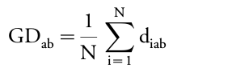

```{r, echo=FALSE}
library(knitr)
```

<br/>
<br/>


# Functional diversity

## 2002 : Petchey & Gaston

**Functional Diversity (FD) index :** total branch length of a functional dendrogram  
(hierarchical classification of the species according to their functional features)

1. building the trait matrix (containing the value of each species for each functional trait)
2. calculating a matrix of distances between pairs of species in functional trait space
3. constructing a dendrogram to classify species according to the distance matrix

The choices of the distance and of the classification method are of crucial importance since they may lead to different results.

<br/>

**Euclidean distance :**

<!-- <div style="text-align:center"></div> -->
```{r, echo=FALSE, fig.align='center', out.width='220px', fig.retina=1}
include_graphics("pictures_tutorials/formula_distance-euclidean.png")
```

with :

- `a, b` : species to be compared
- `N` : number of quantitative traits
- `xia, xib` : values of trait i for each species

<br/>

## 2006 : Podani & Schemra

**Gower's distance :** can cope with mixed scale types of data :

- quantitative,
- interval,
- nominal or ordinal data,
- ratios,
- missing values.

<br/>

<div style="text-align:center">
 with 

</div>


with :

- `a, b` : species to be compared
- `N` : number of quantitative traits
- `diab` : dissimilarity between species for trait i
- `xia, xib` : values of trait i for each species

- If `xia` or `xib` is missing, `wiab = 0`.
- If no missing value, all quantitative traits and each trait equally weighted :

<!-- <div style="text-align:center"></div>  -->
```{r, echo=FALSE, fig.align='center', out.width='220px', fig.retina=1}

```

<br/>

1. Advises the use of Gower’s distance even when all traits are quantitative.
2. Single linkage tends to contract space by compressing edges of the dendrograms whereas complete linkage tends to dilate data space to produce compact classes.

<br/> 

## 1998 : Legendre & Legendre

Some algorithms are well known to cause a distortion of space.

Clustering methods for constructing a hierarchical classification :

<br/>

| Acronym    | Clustering method    | Signification    |
| ---------- | -------------------------------------- | -------------------------------------- |
| SL | Single linkage | Fusion of the closest objects  |
| CL | Complete linkage | Fusion of the most distant objects |
| UPGMA | Unweighted pair group method using arithmetic averages | Fusion of clusters when the similarity reaches the mean inter cluster similarity value |
| WPGMA | Weighted pair group method using arithmetic averages | Mean dissimilarity between two items is the sum of the weighted dissimilarities |
| UPGMC | Unweighted pair group centroid method | Fusion of the clusters with closest centroids |
| WPGMC | Weighted pair group centroid method | Fusion of the clusters with closest centroids after adjustment for group sizes |
| Ward | Ward’s method | Minimization of the within-group sum of squares |
|  |  |  |
|  | Consensus algorithms | Synthesis from different dendrograms into one classification which highlights the concordant parts between the various methods relative to the parts that disagree |
|  |  |  |

<br/> 

**Cophenetic correlation :**

- measure of how faithfully a dendrogram preserves the pairwise distances between the original unmodeled data points
- dissimilarity between initial distance and cophenetic distance matrices
 - `DM = 1 - c²` with `c` : cophenetic correlation coefficient (e.g. Pearson correlation coefficient)  
 *`DM = 0` : no distortion between distance matrices*

<br/>

## 2006 : Rao & Srinivas

Defined a threshold for validity of a dendrogram: the dissimilarity between initial distance and cophenetic distance matrices, DM, must be less than 0.36 (corresponding to the 0.8 correlation coefficient limit).

## 2008 : Mouchet

Aims to :

1. find the *combination of distance and clustering algorithm(s)*  
that best represents species distribution in functional trait space
2. test also *consensus trees resulting from a combination of several clustering algorithms*,  
to enhance the reliability of the classification and, ultimately, the estimation of functional diversity.

The effects of distances, clustering methods, correlations between traits and species richness on dissimilarity were explored using a four factor ANOVA.

<br/>

Dissimilarity was influenced by all the factors and their interactions. However, the complexity of interactions between factors made identification of the direct effects of each factor on DM difficult. Consequently, **no combination of distance and clustering methods gave systematically the best representation of species from the multidimensional functional space.** Nevertheless, among all combinations, **UPGMA/UPGMC consensus trees seemed to be most often used**.

- Despite their drawbacks, **single linkage and complete linkage must not be ignored** because they are regularly included in the consensus trees yielding the lowest DM.
- **UPGMA is a good compromise** between single linkage and complete linkage because it preserves most of the initial distances in dimensionally reduced space.
- **The Ward’s method, though widely used, produces the least reliable classifications.**

<br/>

*None of the clustering algorithms (even UPGMA) perfectly corresponds to the distribution of objects in a multidimensional space. Therefore, it is worth gathering information from different clustering methods into consensus trees.*

<br/>

However cophenetic correlation does not take into account the transformation of the trait matrix into a distance matrix. More studies are needed to assess the impact of that transformation and of the use of other distances (Manhattan, Bray-Curtis, etc.).


<br/>
<br/>

# Glossary 

- **Cophenetic similarity / distance :**
    - measure of how similar two objects have to be in order to be grouped into the same cluster
    - height of the dendrogram where the two branches that include the two objects merge into a single branch
    
- **Cophenetic correlation :** measure of how faithfully a dendrogram preserves the pairwise distances between the original unmodeled data points.

<br/>
<br/>


# Citations

- Legendre P. and Legendre L. (1998). Numerical Ecology. Elsevier, Amsterdam, p. 853, 1998.
- Mouchet, Maud & Guilhaumon, Francois & Villéger, Sébastien & Mason, Norman & Tomasini, Jean & Mouillot, David. (2008). Towards a consensus for calculating dendrogram-based functional diversity indices. Oikos. 117. 794 - 800. https://doi.org/10.1111/j.0030-1299.2008.16594.x
- Petchey, O. L., & Gaston, K. J. (2002). Functional diversity (FD), species richness and community composition. Ecology letters, 5(3), 402-411. https://doi.org/10.1046/j.1461-0248.2002.00339.x
- Podani, Janos & Schmera, Dénes. (2006). On dendrogram-based measures of functional diversity. Oikos. 115. 179 - 185. https://doi.org/10.1111/j.2006.0030-1299.15048.x
- Rao, A. Ramachandra & Srinivas, Venkata. (2006). Regionalization of watersheds by hybrid-cluster analysis. Journal of Hydrology - J HYDROL. 318. 37-56. https://doi.org/10.1016/j.jhydrol.2005.06.003


