---
title: "DIVERSITY indices : partitioning"
date: "23/02/2018"
output:
  html_document:
    number_sections: no
    toc: yes
    toc_float:
      collapsed: false
      smooth_scroll: false
---	

<br/><br/>

# Glossary {.tabset .tabset-fade .tabset-pills} 

## Components

- **Patch :** an area over which there is no significant change in the taxonomic composition of a community.
- **Habitat :** a distinct set of environmental conditions; can include multiple community states.
- **Landscape :** an area including one or more patches and one or more habitats.

<br/>

- **Alpha diversity :** local diversity, within-habitat diversity, within-patch diversity.
- **Beta diversity :** between-sampling unit diversity (NOT LIMITED to change along 
gradients).
- **Gamma diversity :** total diversity of a region or landscape.

<br/>
<br/>

## Theory

- **Diversity is dependent on the scale of sampling.**  
*MacArthur & Wilson’s theory of island biogeography (see Rosenzweig 1994), Whittaker (1972)*

<br/>

- **Concavity :** diversity at any level in the hierarchy must be equal to or greater than the average diversity of the contributing diversity components (gamma > alpha moyen).  
*OK for all indices, Rao PD/FD if distances are euclidean*

- **Monotonicity :** adding a species in the community increases the diversity.  
*Not always true for Rao, since the 0 diagonal in the distance matrix is included in calculation*

<br/>
<br/>


# Diversity measures of relative similarity

## 1902 : Jaccard

**Coefficient of community (percentage of co-occurrence) :**

<!-- <div style="text-align:center">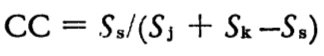</div>   -->
```{r, echo=FALSE, fig.align='center', out.width='200px', fig.retina=1}

```

with :

- `Ss` = number of species shared between two sites
- `Sj` = number of species in the first site
- `Sk` = number of species in the second site

This can be recombined into :

- `Ss = a`
- `Sj = a + b`
- `Sk = a + c`

with :

- `a` = number of species shared between two sites
- `b` = number of species unique to the *poorest* site
- `c` = number of species unique to the *richest* site

leading to :

<!-- <div style="text-align:center">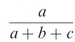</div>   -->
```{r, echo=FALSE, fig.align='center', out.width='100px', fig.retina=1}

```

<br/>

## 1948 : Sorensen

**Coefficient of community (percentage of co-occurrence) :**

<!-- <div style="text-align:center">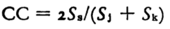</div>   -->
```{r, echo=FALSE, fig.align='center', out.width='200px', fig.retina=1}

```

with :

- `Ss` = number of species shared between two sites
- `Sj` = number of species in the first site
- `Sk` = number of species in the second site

This can be recombined into :

- `Ss = a`
- `Sj = a + b`
- `Sk = a + c`

with :

- `a` = number of species shared between two sites
- `b` = number of species unique to the *poorest* site
- `c` = number of species unique to the *richest* site

leading to :

<!-- <div style="text-align:center">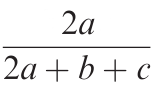</div>   -->
```{r, echo=FALSE, fig.align='center', out.width='100px', fig.retina=1}

```

<br/>

## 1957 : Bray & Curtis

**Percentage similarity :**

<!-- <div style="text-align:center">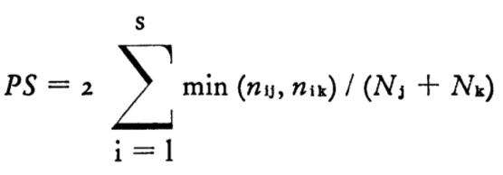</div>   -->
```{r, echo=FALSE, fig.align='center', out.width='300px', fig.retina=1}

```

with :

- `nij, nik` = unrelativized importance values for a given species `i` in samples `j` and `k`
- `Nj, Nk` = total unrelativized importance values in samples `j` and `k`

<br/>

# Beta partitioning

## 2012 : Baselga (Methods Ecology Evolution)

***Jaccard and Sorensen dissimilarity** represent the opposite tenants of **Jaccard and Sorensen CC** (presented before).  
Instead of looking at the percentage of co-occurring species between two sites, they look at the percentage of different species between these two sites.*

<br/>

<!-- <div style="text-align:center"> -->
<!-- 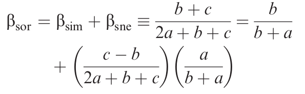 -->

<!-- <br/> -->
<!-- 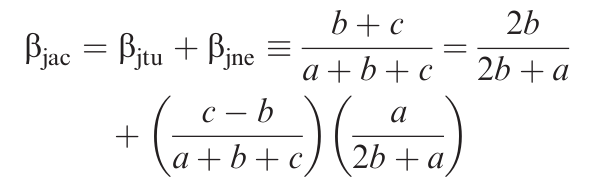 -->
<!-- </div>   -->

```{r, echo=FALSE, fig.align='center', out.width='300px', fig.retina=1}

```
```{r, echo=FALSE, fig.align='center', out.width='300px', fig.retina=1}

```

with :

- `a` = number of species shared between two sites
- `b` = number of species unique to the *poorest* site
- `c` = number of species unique to the *richest* site

- `Bsim` = Simpson dissimilarity, **turnover** component of Sorensen dissimilarity
- `Bsne` = **nestedness** component of Sorensen dissimilarity

- `Bjtu` = **turnover** component of Jaccard dissimilarity
- `Bjne` = **nestedness** component of Jaccard dissimilarity

<br/>

## 2013 : Baselga (Methods Ecology Evolution)

***Delta Bray-Curtis index** (opposite of Bray-Curtis PS) is equal to **Sorensen dissimilarity**.*

<br/>

<!-- <div style="text-align:center"> -->
<!-- 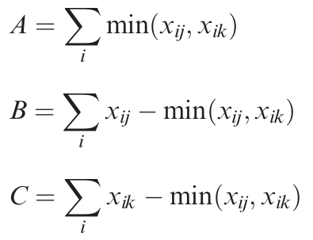 -->
<!-- 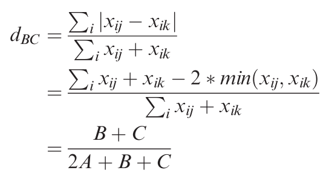 -->
<!-- </div>  -->
```{r, echo=FALSE, fig.align='center', out.width='200px', fig.retina=1}

```
```{r, echo=FALSE, fig.align='center', out.width='300px', fig.retina=1}

```

<br/>

Using an *analogous reasoning as for separating the turnover and nestedness components* of incidence-based dissimilarity, the **balanced variation** and **abundance gradient** components of Bray-Curtis dissimilarity can be separated as follows :

<!-- <div style="text-align:center"> 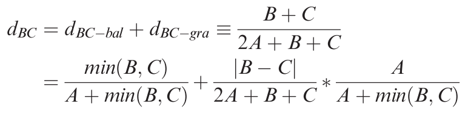 </div> -->
```{r, echo=FALSE, fig.align='center', out.width='450px', fig.retina=1}

```

with :

- `dBC-bal` = **turnover** equivalent
- `dBC-gra` = **nestedness** equivalent

<br/>

<!-- <div style="text-align:center"> -->
<!-- 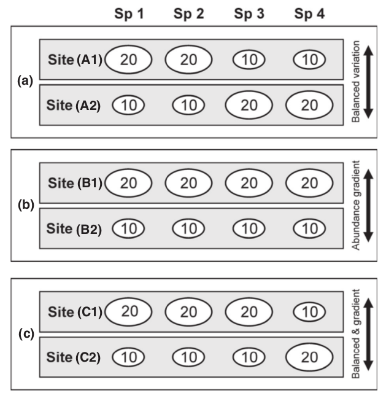 -->
<!-- 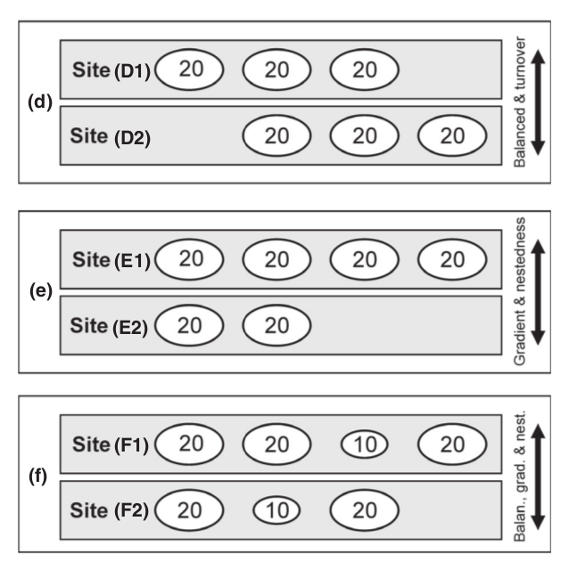 -->
<!-- </div>  -->
```{r, echo=FALSE, fig.align='center', out.width='300px', fig.retina=1}

```
```{r, echo=FALSE, fig.align='center', out.width='300px', fig.retina=1}

```

<br/>


# Diversity partitioning

## 1972 : Whittaker (Taxon)

**Beta diversity :**

- ratio of number of species in a composite sample (combining a number of alpha samples)  
divided by the mean number of species in the alpha samples 
- ratio of gamma divided by mean alpha

<br/>

**Multiplicative relationship between Alpha, Beta and Gamma :**

<!-- <div style="text-align:center">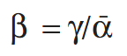</div>   -->
```{r, echo=FALSE, fig.align='center', out.width='100px', fig.retina=1}

```

<br/>

## 1996 : Lande (Oikos)

**Additive Diversity Partitioning (ADP) :**

<!-- <div style="text-align:center">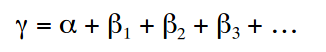</div>   -->
```{r, echo=FALSE, fig.align='center', out.width='300px', fig.retina=1}

```

- Total diversity and its components have the same units and can be compared directly.

<br/>

## 2007 : Jost (Ecology)

**Basic properties of intuitive alpha and beta :**

1. Alpha and beta should be free to vary independently (Shmida 1984).
2. A given number should denote the same amount of diversity or uncertainty, whether it comes from the alpha component, the beta component, or the gamma component, so that the within-community and among-community components could be directly compared (Lande 1996).
3. Alpha is some type of average of the diversity indices of the communities or samples that make up the region.
4. Gamma must be completely determined by alpha and beta.
5. Alpha can never be greater than gamma.

<br/>

**Decomposition of standard diversity indices into *independent* components :**


|        | q = 0 | q = 1 | q = 2 |
|--------------------------|--------------------------|--------------------------|--------------------------|
| *Standard diversity indices*  | Species richness <br/> **Htot = Ha x Hb**    | Shannon entropy <br/> **Htot = Ha + Hb**    | Simpson index <br/> **Htot = Ha x Hb** <br/><br/> Gini-Simpson index <br/> **Htot = Ha + Hb - (Ha x Hb)**   |
| *Numbers equivalents* <br/> *Hill numbers* | Species richness    | Exponential of Shannon entropy <br/> **Htot = Ha x Hb**    |  Inverse of (Gini)-Simpson index  |
|        |  |  |  |

<br/>

**Decomposition of Hill's numbers using Whittaker's law :**

<!-- <div style="text-align:center">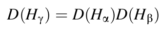</div>   -->
```{r, echo=FALSE, fig.align='center', out.width='300px', fig.retina=1}

```

<!-- <div style="text-align:center">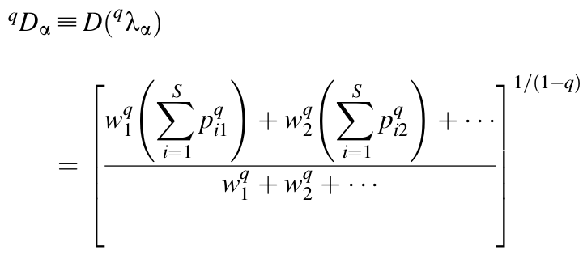</div> -->
```{r, echo=FALSE, fig.align='center', out.width='500px', fig.retina=1}

```

*The second formula is used to calculate alpha and gamma components,  
and the first formula is used to obtain beta component.*

<br/>

**1. Special case when community weights are all equal (verifying all 5 basic properties) :**

|        | q = 0 | q = 1 | q = 2 |
|--------------------------|--------------------------|--------------------------|--------------------------|
| *Standard diversity indices*  | Species richness <br/> **Hb = Hg / Ha**    | Shannon entropy <br/> **Hb = Hg + Ha**    | Simpson index <br/> **Hb = Hg / Ha** <br/><br/> Gini-Simpson index <br/> **Hb = (Hg - Ha) / (1 - Ha)**   |
| *Numbers equivalents* <br/> *Hill numbers* | Species richness    | Exponential of Shannon entropy <br/> **Hb = Hg / Ha**    |  Inverse of (Gini)-Simpson index  |
|        |  |  |  |

<br/>

**2. When community weights are unequal, only Shannon concentration verifies all 5 basic properties.**

<br/>

## 2014 : Chiu (Ecological Monographs)

<br/>

## 2015 : Chalmandrier (Methods Ecology Evolution)

<!-- <div style="text-align:center"> 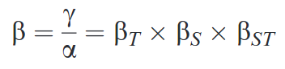 </div>  -->
```{r, echo=FALSE, fig.align='center', out.width='250px', fig.retina=1}

```

with :

- `Bt` = change in diversity between time pools, **temporal change** irrespective of the spatial patterns
- `Bs` = change in diversity between site pools, **spatial change** after averaging the temporal variability
    - minimum value = 1
    - maximum value = if site pools (`Bs`), time pools (`Bt`), communities (`B`) do not share species or tree branches

<br/>

- `Bst` =
    - **interaction between spatial and temporal turnover**, to quantify finer changes (e.g. rearrangement of species between sites between two dates)
    - `= 1` : identical change of diversity across space and time between communities
    - `> 1` : heterogeneity of change of communities over space and time that is not quantified by `Bs` and `Bt` because it averages out at larger spatial or temporal scales

<br/>


## 2016 : Reeve

<br/>
<br/>


# Citations

- Baselga, A. and Orme, C. D. L. (2012). betapart: an R package for the study of beta diversity. Methods in Ecology and Evolution, 3: 808–812. doi:10.1111/j.2041-210X.2012.00224.x
- Baselga, A. (2013). Separating the two components of abundance-based dissimilarity: balanced changes in abundance vs. abundance gradients. Methods Ecol Evol, 4: 552–557. doi:10.1111/2041-210X.12029
- Bray, J., & Curtis, J. (1957). An Ordination of the Upland Forest Communities of Southern Wisconsin. Ecological Monographs, 27(4), 326-349. doi:10.2307/1942268
- Chalmandrier, L., Münkemüller, T., Devictor, V., Lavergne, S. and Thuiller, W. (2015). Decomposing changes in phylogenetic and functional diversity over space and time. Methods Ecol Evol, 6: 109–118. doi:10.1111/2041-210X.12297
- Chiu, C., Jost, L., & Chao, A. (2014). Phylogenetic beta diversity, similarity, and differentiation measures based on Hill numbers. Ecological Monographs, 84(1), 21-44. (http://www.jstor.org/stable/43187595)
- Jaccard, P. (1902). Lois de distribution florale dans la zone alpine. Bulletin de la Société vaudoise des sciences naturelles. 38. 69-130. doi:10.5169/seals-266762.
- Jost, L. (2007). Partitioning Diversity into Independent Alpha and Beta Components. Ecology, 88(10), 2427-2439. (http://www.jstor.org/stable/27651387)
- Lande, R. (1996). Statistics and Partitioning of Species Diversity, and Similarity Among Multiple Communities. Oikos. 76. 5-13. doi:10.2307/3545743. 
- Reeve, R. & Matthews, L., & Cobbold, C. & Leinster, T. & Thompson, J & Brummitt, N. (2014). How to partition diversity. (http://arxiv.org/abs/1404.6520)
- Sorenson, T. (1948). A Method of Establishing Groups of Equal Amplitudes in Plant Sociology Based on Similarity of Species Content and Its Application to Analyses of the Vegetation on Danish Commons. Kongelige Danske Videnskabernes Selskab, Biologiske Skrifter, 5, 1-34.
- Whittaker, R. (1972). Evolution and Measurement of Species Diversity. Taxon, 21(2/3), 213-251. doi:10.2307/1218190


