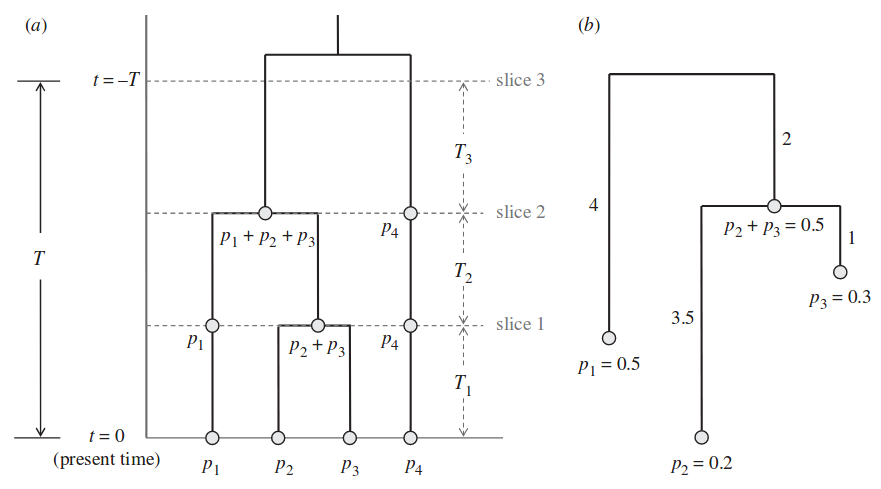

<br/><br/>


# 2011 : Vellend

## Indices of species' distinctness

| Index | Description | Type of tree | Reference |
|--------------------------- | ------------------------------------- | ------------ | ------------ |
| **Taxonomic distinctness (TD)** | Reciprocal of number of nodes between species and root of tree | node-based | *1991 : Vane-Wright* |
| | To account for polytomies, count number of descendants at each node rather than number of nodes | | *1990 : May* |
| **Species originality (SO)** | Assign each node in a tree a value of 1 if more species descend from that node than its sister node, and 0 otherwise; sum the values at the nodes between a species and the root; smaller values indicate greater distinctness | node-based | *1992 : Nixon & Wheeler* |
| | | |
| **Pendant edge (PE)** | Length of the branch connecting a species to the rest of the regional tree | distance-based | *1990 : Altschul & Lipman* |
| **Species evolutionary history (SEH)** | Portion of a phylogenetic tree attributable to a species; shared branches are apportioned equally among descendant lineages | distance-based | *2006 : Redding & Mooers* |
| **Originality of species within a set (OSS)** | Values for each species that ‘maximize the expected dissimilarity between two species randomly drawn from the set’ | distance-based | *2005 : Pavoine* |
| | | |

<br/>

## Type I metrics

1. Calculating a distinctness score for all species in a regional phylogeny
2. Calculating some function of these scores (typically the sum) for particular subsets of species

<br/>

## Type II metrics

1. Starting with a local phylogeny

<br/>

Aggregation of metrics according to :

- nature of the phylogenetic tree
      - distance-based metrics
      - counting nodes metrics (special case of first)
- nature of species data
      - abundances
      - presence-absence (special case of first)
      
<br/>

| Index | Description <br/> presence-absence | Description <br/> abundance-weighted | Equation | 
| ------------ | -------------------------------- | -------------------------------- | ------------ |
| **Phylogenetic diversity (PD)** | *1992 : Faith* <br/> Sum of all branch lengths in the portion of a phylogenetic tree connecting the focal set of species | *2002 : Barker* <br/> For the subset tree, the number of branches multiplied by the weighted mean branch length, with weights equal to the average abundance of species sharing that branch | | |
| **Mean phylogenetic distance (MPD)** | *2000 : Webb* <br/> Mean phylogenetic distance between each pair of species in the focal set | *1995 : Warwick & Clarke (1982 : Rao)*<br/> Mean phylogenetic distance between pairs of individuals, excluding (or not) same-species pairs | | |
| **Sum of phylogenetic distances (SPD)** | *1997 : Crozier* <br/> Sum of phylogenetic distances between each pair of species <br/> MPD x number of species pairs | *2007 : Helmus* <br/> Abundance-weighted MPD x number of species pairs| | |
| **Mean nearest neighbour distance (MNND)** | *2000 : Webb* <br/> Mean phylogenetic distance from each species to its closest relative in the focal species set | Weighted mean phylogenetic distance from each species to its closest relative, with weights equal to species’ abundance | | |
| | | | | |

<br/>

# 2013 : Faith

**Phylogenetic Diversity (PD) :** basis for a measure of biodiversity, that would consider all possible units  
(genes, features, species, ecosystems). 

Required information about expected relationships among the objects provided by :

- phylogeny
- associated evolutionary models linking phylogenetic pattern to variation at the level of features/units

<br/>

**Link between PD and species richness (SR) ?**

1. When subsets of different numbers of species are selected randomly from the tree, the average PD value for a given species number has a *power curve relationship* with the number of species in the subset.
2. Departures from the basic power curve depend on the nature of these departures from random sets — whether the species extinctions are clumped or well dispersed on the phylogenetic tree.

<br/>


**PD of a set of species from a phylogenetic tree :** minimum total length of all the phylogenetic branches required to connect all those species on the tree.

<br/>


### Loss or gain of species

- **Loss of species :** loss of features exclusively represented by these species = **endemism**

- **Loss of area :** loss of SR with the loss of species that were exclusively found in this area = **complementarity**

<br/>

### Probabilities of loss

**Expected PD :** PD given a set of species' extinction probabilities.  
*Species case of Weitzman's general expected diversity formula.*

- **Delta PD q :** change in expected PD if probability extinction of species (e.g. in a given area) changes from `q` to 1.  
*The value will be large to the extent that the species shares long ancestral branches with few other species.*

- **PD50 :** change in expected PD with a current probability of extinction of 0.5 for all species.  
*The value will be large when the species has long ancestral branches with few other descendants.*

<br/>

### Dissimilarities

- **PD dissimilarities :** differences of evolutionary features between samples or localities  
(sum of branches in one site only, divided by sum of all branches).

<br/>

### Dissimilarities with abundance information

- **Chao's framework**

- **Effective rare PD :** defines “Valley numbers” in which the flexible parameter provides increasing focus on low abundance.  
*Effective amount of rare feature diversity*

<br/>


# Dissimilarities (beta) & partitioning

**PhyloSor :**

- derived from the taxonomic-based *Sorensen* dissimilarity index

**UniFrac :**

- derived from the taxonomic-based *Jaccard* dissimilarity index
- total branch length unique to each community relative to the total branch length linking all species in both communities
- measures the proportion of evolutionary history unique to each community

<br/>
<br/>

# Glossary 

- **Node-based tree :** simplest type of phylogenetic tree which represents only the topology, with no information on the lengths of branches connecting the nodes.
- **Distance-based tree :** with quantitative branch lengths.

- **Ultrametric tree** = in which the distances from the root to every branch tip are equal  
                  = if the branch lengths are proportional to divergence time, all branch tips are the same distance from the tree base (first node)
                  = a) on the graph, b) is non-ultrametric
                  
<!-- <div style="text-align:center"></div>  -->
```{r, echo=FALSE, fig.align='center', out.width='600px', fig.retina=1}

```

- **Balanced tree :** all tips are separated from the root by the same number of nodes, which is equivalent to saying that all lineages bifurcate the same number of times.
- **Imbalanced tree :** one lineage descending from each node connects directly to a tip with no further bifurcations.

- **Polytomie :** node where the lineage splits into three or more (most commonly due to data limitations).
- **Evenness :** an even distribution of branches within the community has branches with about equal abundance; uneven distributions may be dominated by one or a few abundant branches.

<br/>
<br/>


# Citations

- Faith D. P. (2013). Biodiversity and evolutionary history: useful extensions of the PD phylogenetic diversity assessment framework. Ann N Y Acad Sci. Jun; 1289:69-89. https://doi.org/10.1111/nyas.12186

    - Barker, G. (2002). Phylogenetic diversity: a quantitative framework for measurement of priority and achievement in biodiversity conservation. Biological Journal of the Linnean Society. 76. 165-194. https://doi.org/10.1046/j.1095-8312.2002.00055.x
    - Crozier, R. (1997). Preserving the Information Content of Species: Genetic Diversity, Phylogeny, and Conservation Worth. Annual Review of Ecology and Systematics, 28, 243-268. http://www.jstor.org/stable/2952493
    - Faith, D. (1992). Conservation evaluation and phylogenetic diversity. Biological Conservation. 61. 1-10. https://doi.org/10.1016/0006-3207(92)91201-3
    - Helmus, M., Bland, T., Williams, C. & Ives, A. (2007). Phylogenetic measures of biodiversity. Am Nat 169(3):E68-E83. The American naturalist. 169. https://doi.org/10.1086/511334
    - Rao, C. R. (1982). Diversity and Dissimilarity Coefficients: A Unified Approach. Theoretical population biology, 21, 24-43. Theoretical Population Biology. 21. 24-43. https://doi.org/10.1016/0040-5809(82)90004-1
    - Warwick, R. & Clarke, K. (1995). New 'biodiversity' measures reveal a decrease in taxonomic distinctness with increasing stress. Marine Ecology Progress Series. 129. 301-305. https://doi.org/10.3354/meps129301
    - Webb, C. (2000). Exploring the Phylogenetic Structure of Ecological Communities: An Example for Rain Forest Trees. The American naturalist. 156. 145-155. https://doi.org/10.1086/303378

- Vellend, M., Cornwell, W., Magnuson-Ford, K. & Mooers, A. (2010). Measuring phylogenetic biodiversity.


