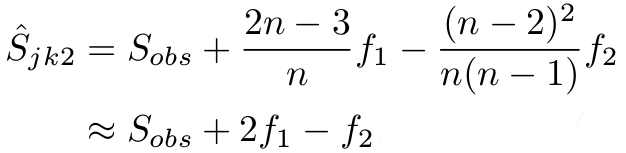

---
title: "DIVERSITY indices : richness"
date: "12/03/2018"
output:
  html_document:
    number_sections: no
    toc: yes
    toc_float:
      collapsed: false
      smooth_scroll: false
---	


```{r, echo=FALSE}
library(knitr)
```

<br/><br/>

# Glossary {.tabset .tabset-fade .tabset-pills} 

- **Parametric methods :** require specific parametric assumptions about the species abundance distribution.  
Different parametric distributions may fit the observed data equally well, but lead to drastically different species richness estimates.

- **Non-parametric methods :** always obtainable and make no assumptions about the mathematical form of the underlying species abundance/incidence distributions.

- **Species richness :** number of observed species + number of undetected species

- **Uniques :** number of species observed in only one sampling unit
- **Duplicates :** number of species observed in exactly two sampling units
- **Super-duplicates :** number of species observed in at least two sampling units


<br/>
<br/>


# Estimators of number of undetected species

Non-parametric estimators based on the information about the infrequently detected (rare) species.

## 1978 : Burnham & Overton

**Jackknife resampling :** technique especially useful to reduce the bias / variance of a biased estimator (similar to bootstrap). The basic idea with the `jth` order jackknife method is to consider sub-data by successively deleting `j` individuals from the data.

**Jackknife estimator of a parameter :**

- for a sample of size `n`,
- calculate the estimates of each n-1-sized sub-sample
- average of these calculations

<br/>

*Estimation of species richness :*

<!-- <div style="text-align:center"></div> -->
```{r, echo=FALSE, fig.align='center', out.width='100px', fig.retina=1}

```

with :

- `N` : total number of individuals / species
- `S` : non-parametric maximum likelihood estimator of N

- `i` : sampling-unit (day, trap, quadrat)
- `t` : total number of sampling units
- `fr` : number of individuals captured exactly r times

<br/>

*Clearly, S is biased and this bias decreases as t increases. Hence the following correction :*

<!-- <div style="text-align:center"></div> -->
```{r, echo=FALSE, fig.align='center', out.width='320px', fig.retina=1}

```

with :

- `j` : individual / species

<br/>

*First-order jackknife :*  
(depending on unique species)

<!-- <div style="text-align:center"></div> -->
```{r, echo=FALSE, fig.align='center', out.width='230px', fig.retina=1}
include_graphics("pictures_tutorials/formula_Burnham-jackknife-3.png")
```

*Second-order jackknife :*  
(depending on unique and duplicate species)

<div style="text-align:center"></div>
```{r, echo=FALSE, fig.align='center', out.width='330px', fig.retina=1}

```

with `n = t`.

<br/>

## 1987 : Chao

This method is especially useful **when most of the captured individuals are caught once or twice in the sample** (very small capture probabilities), *for which case the kackknife estimator usually does not work well*.

If there are many undetectable species, then it will be impossible to obtain a good estimate of species richness. A reliable lower bound for SR if often more practical use than an imprecise point estimate.  
*It is a minimum estimator of asymptotic species richness.*

<br/>

**Chao1 estimator (number of undected species for abundance data) :**

<!-- <div style="text-align:center"></div> -->
```{r, echo=FALSE, fig.align='center', out.width='400px', fig.retina=1}

```

<br/>

**Chao2 estimator (number of undected species for incidence data) :**

<!-- <div style="text-align:center"></div> -->
```{r, echo=FALSE, fig.align='center', out.width='500px', fig.retina=1}

```

with :

- `S obs` : count of the total number of species observed
- `T` : number of sampling units
- `f1/Q1` : uniques
- `f2/Q2` : duplicates

<br/>


## 1994 / 1998 : Lee & Chao, Chazdon

**Incidence-based coverage estimator (ICE) :** 

<!-- <div style="text-align:center"></div> -->
```{r, echo=FALSE, fig.align='center', out.width='280px', fig.retina=1}

```
with :
<!-- <div style="text-align:center"></div> -->
<!-- <div style="text-align:center"></div> -->
```{r, echo=FALSE, fig.align='center', out.width='420px', fig.retina=1}

```
```{r, echo=FALSE, fig.align='center', out.width='180px', fig.retina=1}

```


with :

- `Qk` : number of species present in `k` sampling units
- `R` : utoff frequency between infrequent and frequent species in the reference sample (= 10 as a start)
- `S infreq` : number of species occurring in fewer than `R` sampling units (frequency counts for rare species)
- `Y infreq` : summed incidence frequencies for species occurring in fewer than `R` sampling units
- `T infreq` : number of sampling units including at least one infrequent species
- `C ICE` : estimate of sample coverage
- `gamma ICE` : squared coefficient of variation

<br/>

# Estimators of number of shared species

## 2012 : Chao (review)

The estimation of *species richness shared by multiple assemblages* (two or more) has received relatively little attention. However, it can be used to describe assemblage overlap and forms a basis *to construct various types of beta diversity and similarity/dissimilarity measures* to quantify spatial or temporal variation in species composition.

There is a generalization of ICE-type shared species richness estimators for two assemblages. However, these estimators cannot be easily extended to the general case when there are more than two assemblages.

<br/>

<!-- <div style="text-align:center"></div> -->
```{r, echo=FALSE, fig.align='center', out.width='200px', fig.retina=1}

```

with :

- `S12` : number of shared species between samples 1 and 2
- `D12` : number of shared species observed
- `f+0` : number of shared species observed in sample 1 but not observed in sample 2
- `f0+` : number of shared species observed in sample 2 but not observed in sample 1
- `f00` : number of undetected species

<br/>

**Chao1-shared estimator (number of shared species for abundance data) :**

<!-- <div style="text-align:center"></div> -->
```{r, echo=FALSE, fig.align='center', out.width='240px', fig.retina=1}

```
with
<!-- <div style="text-align:center"></div> -->
```{r, echo=FALSE, fig.align='center', out.width='150px', fig.retina=1}
include_graphics("pictures_tutorials/formula_Chao1-shared-estimator-3.png")
```

<br/>

with :

- `ni` : size of sample i
- `fjk` : number of shared species that are observed j times in sample 1 and k times in sample 2

*Only those shared species that are singletons or doubletons in at least one of the samples are used to infer the undetected shared species richness.*
<br/>

**Chao2-shared estimator** (number of shared species for incidence data) follows the same structure.

<br/>

# Models to infer species richness

## 1953 / 2000 : Good (& Turing)

Detection probabilities of unique species do not vary greatly among such species, so that most of the detection probabilities of uniques are concentrated at the average.

<br/>

## 2012 : Chao (review)

- **Rarefaction (interpolation) :** traditional method to down-sample the larger samples, when comparing the sample richnesses of different assemblages, until they are the same size  
(*but loss of information*)

- **Curve-fitting approaches :** generally do not provide the variances of the resulting estimates

    - **Extrapolation :** use parametric curves to extrapolate a species-accumulation or species-area curve to predict its asymptote, which is used as an estimate of species richness, for hypothetical samples larger than the actual samples  
(*can be reliable to about twice the actual sample sizes*)

    - **Curve-fitting :** fit a truncated parametric distribution or functional form to the observed species abundances to obtain an estimate of species richness

- **Sampling-theory-based approaches :** two type of sampling data :

    - individual-based (abundance) data
    - sample-based (incidence) data

<br/>

## 2012 : Colwell

For sample-based incidence data :

- **interpolation** : sample-based rarefaction (Bernoulli product model)

- **extrapolation** : estimate of asymptotic species richness for a larger number of sampling units,  
which requires an estimation of the number of undetected species :  

    - Chao2 estimator
    - ICE for assemblages with many rare species

<br/>

# Incidence-based models

Especially advantageous for *social species* (individuals difficult to distinguish and to count), and avoid the risk of double-counting individuals within sessions.


Usually require :

- Count of the total number of species observed
- Number of unique species
- Number of duplicate species

## 2017 : Chao

*Extension of incidence-based sampling model of Colwell* to encompass datasets with only :

- Count of the total number of species observed
- Number of super-duplicate species

<br/>

**STEPS** :

1. Estimate the **true number of duplicates** with :
      - observed numbers of uniques (`S obs = S uniques + S super-duplicates`)
      - observed numbers of super-duplicates (species observed in at least two sampling units)
      
<div style="text-align:center"> **Good-Turing frequency formula** </div>
<br/>

2. Infer the **number of undected species** with :
      - observed numbers of uniques
      - estimated number of duplicates
      
<div style="text-align:center"> **Chao2 formula** </div>
<br/>

3. Infer the **species richness** with :
    - observed numbers of species
    - estimated number of undetected species
    
<div style="text-align:center"> **`SR estimated = S obs + S undetected`** </div>


<br/>
<br/>


# Citations

- Burnham, K., & Overton, W. (1978). Estimation of the Size of a Closed Population when Capture Probabilities vary Among Animals. Biometrika, 65(3), 625-633. https://doi.org/10.2307/2335915
- Chao, A. (1987). Estimating the Population Size for Capture-Recapture Data with Unequal Catchability. Biometrics, 43(4), 783-791. https://doi.org/10.2307/2531532
- Chao, A. & Chiu, C.-H. (2012) Estimation of species richness and shared species richness. In Methods and Applications of Statistics in the Atmospheric and Earth Sciences (ed. N. Balakrishnan), pp. 76–111, Wiley, New York, NY, USA.
- Chao, A., Colwell, R. K., Chiu, C.-H. and Townsend, D. (2017), Seen once or more than once: applying Good–Turing theory to estimate species richness using only unique observations and a species list. Methods Ecol Evol, 8: 1221–1232. https://doi.org/10.1111/2041-210X.12768
- Chazdon, Robin & Colwell, Robert & S. Denslow, J & Guariguata, Manuel. (1998). Statistical methods for estimating species richness of woody regeneration in primary and secondary rain forests of NE Costa Rica. In Forest biodiversity research, monitoring and modelling. 285-309. 
- Colwell, Robert & Chao, Anne & J. Gotelli, Nicholas & Lin, SY & Mao, Chang Xuan & Chazdon, Robin & T. Longino, John. (2012). Models and estimators linking individual-based and sample-based rarefaction, extrapolation and comparison of assemblages. Journal of Plant Ecology. 5. 3-21. https://doi.org/10.1093/jpe/rtr044.
- Good, I. (1953). The Population Frequencies of Species and the Estimation of Population Parameters. Biometrika, 40(3/4), 237-264. https://doi.org/10.2307/2333344
- Lee, S., & Chao, A. (1994). Estimating Population Size Via Sample Coverage for Closed Capture-Recapture Models. Biometrics, 50(1), 88-97. https://doi.org/10.2307/2533199
