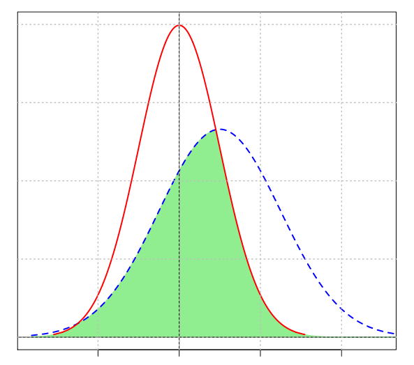

---
title: "MODELS : meta analysis"
date: "10/12/2020"
output:
  html_document:
    number_sections: no
    toc: yes
    toc_float:
      collapsed: false
      smooth_scroll: false
---	


```{r, echo=FALSE}
library(knitr)
```

<br/>
<br/>

# Publication bias

- research in the published literature is **unrepresentative** of the population of completed studies
- originally defined as the publication or non-publication of studies depending on the direction and statistical significance of the results
- language, availability, cost, familiarity, outcome (= dissemination bias)

$\rightarrow$ especially problematic when it comes to systematic review and meta-analytic methods (aiming to summarize research)

</br>

1. **Detect publication bias**
    - test funnel plot assymmetry (Begg and Mazumdar 1994, Egger et al 1997, Sterne and Egger)
2. **Assess sensitivity of analysis to (possible) publication bias**
    - failsafe N, or file-drawer analysis (Harris Cooper 1979)
3. **Adjust estimates for (possible) effect of publication bias**
    - trim and fill method (Duval and Tweedie)

(*Rothstein review 2005*)

</br></br>


# Effect size

## $\neq$ with statistical significance

Any statistical test depends on four quantities :

1. **P-Value**
    - = probability that a difference of at least the same size would have arisen by chance, even if there really were no difference between the two populations
    - = *statistical significance*
    - does not give information about the magnitude of an effect
    - depends essentially on sample size and on effect size
    - BUT ‘significant’ with (big effect, and small sample) or (big sample, and small effect)
2. **Sample size**
    - Test statistics are usually a function of sample size, so can not serve as ES.
3. **Effect size**
    - = measures to quantify the degree to which a phenomenon exists
    - = quantifies the size of the difference between two groups
    - emphasises the size of the difference rather than confounding it with sample size
    - Each hypothesis test needs a relevant ES, together with an estimate of its likely ‘margin for error’ or ‘confidence interval’
4. **Power of the test**


(*Coe 2002*, *Jamalzadeh 2010*)

</br>

## Measures of effect size

### 1977 : Cohen (d)

- *standardised mean difference*
- 2 normal populations with same standard deviation
- important to say which way round the calculation was done
- /!\\ very sensitive to violations of normality assumption

$$d = \frac{\bar{x_1} - \bar{x_2}}{\sigma}$$

### 1985 : Hodges (s)

- 2 normal populations with non-equal standard deviation

$$s = \sqrt{\frac{(n_1 - 1) \cdot s_1^2 + (n_2 - 1) \cdot s_2^2}{n_1 + n_2 - 2}}$$

### 1992 : McGraw & Wong (CLES)

- *Common Language Effect Size* = probability that a randomly selected individual from one group have a higher score on a variable than a randomly selected individual from another group
- 2 normal populations with same standard deviation
- $0.5$ $\Rightarrow$ $x$ and $y$ populations overlap (identical), $0$ or $1$ $\Rightarrow$ larger effect size

$$CLES = \Phi \left( \frac{\mu_y - \mu_x}{\sqrt{2} \cdot \sigma} \right)$$

### 1992 : Cohen (NOES)

- *Non-Overlap Effect Size* = amount of combined area under the density probability distribution function not shared by two populations
- no need for normality assumption
- $0$ = small effect size, $1$ = large effect size

```{r, echo=FALSE, fig.align='center', out.width='200px', fig.retina=1}

```

### 1993 : Cliff (NPES)

- *Non-Parametric Effect Size* = enumerating the number of occurrences of an observation from one group having a higher response value than an observation from the second group, and the number of occurrences of the reverse
- no need for normality assumption
- $0$ = small effect size, $1$ = large effect size

$$NPES = \delta = \frac{\Sigma_{i=1}^{n_1} \Sigma_{j=1}^{n_2} sign(x_{i1} - x_{j2})}{n_1 \cdot n_2}$$

### QAD

- *Quantile Absolute Deviation* = average absolute distance between the quantiles of two populations
- $F^{-1}$ and $G^{-1}$ = quantile functions (cumulative distribution functions) for 2 statistical populations
- $QAD(F,F) = 0$, and $QAD(F,G) = 0$ if and only if $F = G$

$$QAD = \int_0^1 |F^{-1}(p) - G^{-1}(p) | dp$$

### DES

- *Divergence Effect Size*
- not symmetric : $DES(F|G) \neq DES(G|F)$

$$DES = 2 \cdot \int_0^1 |G\{F^{-1}(p)\} - G\{G^{-1}(p)\} | dp$$

</br>

## Interpretation(s)

- **statements about the overlap between the two samples in terms of a comparison of percentiles**

*An effect size is exactly equivalent to a ‘Z-score’ of a standard Normal distribution. For example, an effect size of 0.8 means that the score of the average person in the experimental group is 0.8 standard deviations above the average person in the control group, and hence exceeds the scores of 79% of the control group.*

- **probability that one could guess which group a person came from, based only on their test score**

*If the effect size were 0 (i.e. the two groups were the same) then the probability of a correct guess would be exactly a half – or 0.50. With a difference between the two groups equivalent to an effect size of 0.3, there is still plenty of overlap, and the probability of correctly identifying the groups rises only slightly to 0.56. With an effect size of 1, the probability is now 0.69, just over a two-thirds chance.*

- **equivalence between standardised mean difference (d) and correlation coefficient (r) (Cohen 1969)**

If group membership is coded with a dummy variable (e.g. denoting the control group by 0 and the experimental group by 1) and the correlation between this variable and the outcome measure calculated, a value of r can be derived :
$$r^2 = \frac{d^2}{(4+d^2)}$$

- **Binomial effect size display (BESD) (Rosenthal and Rubin (1982))**

If the outcome measure is reduced to a simple dichotomy (for example, whether a score is above or below a particular value such as the median, which could be thought of as ‘success’ or ‘failure’), r can be interpreted as the difference in the proportions in each category.

*For example, an effect size of 0.2 indicates a difference of 0.10 in these proportions, as would be the case if 45% of the control group and 55% of the treatment group had reached some threshold of ‘success’. Note, however, that if the overall proportion ‘successful’ is not close to 50%, this interpretation can be somewhat misleading (Strahan 1991, McGraw 1991).*

- **Proportion of variance accounted for ?**

    - $r$ = correlation between two variables
    - $R^2 = r^2$ = proportion of the variance in each that is ‘accounted for’ by the other </br>
    proportion by which the variance of the outcome measure is reduced when it is replaced by the variance of the residuals from a regression equation (close analogies in ANOVA) </br>
    $\rightarrow$ sometimes advocated as a universal measure of effect size (e.g. Thompson, 1999) ?
    
    - BUT :
      - sensitivity to violation of assumptions (heterogeneity of variance, balanced designs)
      - associated standard errors can be large (Olejnik and Algina, 2000)
      - generally more statistically complex and hence perhaps less easily understood
      - non-directional (2 studies with precisely opposite results would report exactly the same variance accounted for)
      - Expressing different measures in terms of the same statistic can hide important differences between them; $R^2$ and 'effect sizes' are fundamentally different, and should not be confused.
    


(*Coe 2002*)

</br>

## Confidence interval

To calculate a 95% confidence interval, you assume that the value you got (*e.g. the effect size estimate of 0.8*) is the ‘true’ value, but calculate the amount of variation in this estimate you would get if you repeatedly took new samples of the same size (i.e. different samples of 38 children). For every 100 of these hypothetical new samples, by definition, 95 would give estimates of the effect size within the ‘95% confidence interval’. If this confidence interval includes zero, then that is the same as saying that the result is not statistically significant. If, on the other hand, zero is outside the range, then it is ‘statistically significant at the 5% level’.

(*Coe 2002*)

### 1985 : Hedges & Olkin

If the effect size estimate from the sample is d, then it is normally distributed, with standard deviation :

$$\sigma[d] = \sqrt{\frac{N_e + N_c}{N_e \cdot N_c} + \frac{d^2}{2 \cdot (N_e + N_c)}}$$
with $N_e$ and $N_c$ the numbers in the experimental and control groups.

Hence a 95% confidence interval for d would be from $(d - 1.96 \cdot \sigma[d])$ to $(d + 1.96 \cdot \sigma[d])$.

</br>

## Influence factors

- **which ‘standard deviation’ to use**
    - often better to use a ‘pooled’ estimate of SD = an average of the SD of the experimental and control groups :
  $$ SD_{pooled} = \sqrt{\frac{(N_e-1) \cdot SD_e^2 + (N_c-1) \cdot SD_c^2}{N_e + N_c - 2}}$$
    - depends on the assumption that the two calculated SD are estimates of the same population value </br> (= that experimental and control group SD differ only as a result of sampling variation) </br>

- **corrections for bias**
    - $SD_{pooled}$ gives a better estimate than the control group SD, BUT still slightly biased (in general gives a value slightly larger than the true population value) (Hedges and Olkin, 1985) </br>

- **restricted range**
    - The spread of scores found within the highly selected group would be much less than that in a true cross-section of the population.
    - Ideally, use the SD of the full population, in order to make comparisons fair. Any comparison with effect sizes calculated from a full-range population must be made with great caution, if at all.
    - *en gros*, attention aux facteurs confondants !

- **non-normal distributions**
    - if normal assumption is not true then the interpretation may be altered
    - in particular, it may be difficult to make a fair comparison between an effect-size based on Normal distributions and one based on non-Normal distributions.

- **measurement reliability**
    - in classical measurement theory, any measure = ‘true’ underlying value + component of ‘error’.
    - PB = amount of variation in measured scores for a particular sample (i.e. its standard deviation) will depend on both the variation in underlying scores and the amount of error in their measurement.
    - $\rightarrow$ reliability of any outcome measure used should be reported
    - (*It is theoretically possible to make a correction for unreliability (sometimes called ‘attenuation’), which gives an estimate of what the effect size would have been, had the reliability of the test been perfect BUT not trusty*)

(*Coe 2002*)

</br>

## From effect size to meta-analysis

When a particular experiment has been replicated, the different effect size estimates from each study can easily be combined to give an overall best estimate of the size of the effect = **meta-analysis**.

$\rightarrow$ seeking relationships between effect sizes and characteristics, context and study design in which they were found </br>
$\rightarrow$ even small studies can make a significant contribution to knowledge </br>
$\rightarrow$ BUT danger of combining incommensurable results

(*Coe 2002*)

</br></br>

# Meta-analysis

## Definition(s)

Hunt 1997 = accumulation of knowledge and research findings

1. **Narrative review**
    - = *A researcher would collect information about the studies she finds important or worthwhile regarding a phenomenon, and make inferences about the model by examining the individual studies. She would try to come up with a final judgment about the connection between the variables, by looking at the different studies and evaluating these studies on several criteria. She may also try to analyze the differences between the studies, by looking at particular study sample- or design- features. The researcher may count the numbers of significant and non- significant results using vote counting. If the majority of the results are significant, the researcher may claim that there is some evidence of effect in the studies. If the votes are similar, the researcher may conclude that no conclusive result is ob- served. Thus, more empirical studies are required.*
    - BUT :
      - highly subjective as to which patterns are considered important and which ones irrelevant
      - do not have a systematic tool for combining the results of several studies
      - focus on statistical significance rather than the magnitude of effect
      - do not adequately correct for sample characteristics, or design features
      - lack of adequate emphasis on inclusion and exclusion criteria for studies

</br>

Glass 1976 = the statistical analysis of a large collection of analysis results from individual studies for the purpose of integrating the findings

2. **Systematic review**
    - focuses on minimizing bias in literature review by using clearly pre-defined criteria so that the literature search is replicable
    - preferred way to do literature review for meta-analysis
  
  
3. **Meta-analysis**
    - statistical analysis of effect sizes
    - statistically combines the effect sizes and models them with study characteristics (**moderators**) to explain the differences (**meta-regression**)
    - focus not on statistical significance but on the magnitude of the effect
    - NEED :
      - enough primary studies (not easy to state the number of studies required)
      - enough information in extracted studies to calculate the effect sizes
      - search strategy not flawed / studies not biased


</br>

$\Rightarrow$ if conditions fulfilled, advisable to combine both systematic review and meta-analysis in the same review process

</br>


## Selection of articles

**Not easy to state the number of studies required**

- **Minimize selection bias :** use more than one database
- **Replicable :** document the search strategy
- Estimate the number of studies required with *power analysis*


- *Whether unpublished studies (dissertations, conferences, unpublished papers) should be included ?*
  - Fergusion and Brannick 2012 :
    (1) may be of weaker methodology,
    (2) may be biased towards the authors conducting the meta-analyses (ease of availability of these studies),
    (3) search for unpublished studies may favor established rather than non-established authors,
    (4) search for unpublished studies may also be biased
  - Rothstein and Bushman 2012 :
    (1) studies may be excluded on the methodological rigorousness by using clearly define inclusion criteria,
    (2) researchers may contact authors who have published in the topic to minimize potential selection bias,
    (3) researchers should include unpublished studies and test whether study characteristics related to methodological quality moderate the effect sizes

</br>


## Effect sizes

- *Unstandardized :* appropriate if the effect sizes can be used to communicate or compare across studies
- **Directional :** indicate direction of treatment or association ($\neq R^2$ in multiple regression, $\eta^2$ ou $\omega^2$ in ANOVA)

3 common types of effect sizes :

- **based on binary outcome :**
    - yes/no, failed/success...
    - relative risk, odds ratio
- **based on mean differences :**
    - to represent the treatment effect between an experimental and a control groups
    - raw mean difference if the scale is meaningful, </br> a standardized mean difference otherwise if the scale is not comparable across studies
- **based on correlation coefficient :**
    - to represent the association between two variables
    - correlation coefficient directly, or transformed to Fisher's Z score to help normalizing the sampling distribution of the correlation when used as an effect size

$\rightarrow$ if the research topic is related to experimental or between group comparisons, mean differences are usually used

$\rightarrow$ it is possible to convert the effect sizes among odds ratio, mean difference and correlation coefficient </br> (no need to exclude studies because of the difference in the reported effect sizes)

**/!\\ An effect size cannot be used in the analysis if its sampling variance is missing.**

</br>


## Testing heterogeneity

- **Fixed-effects model (common)**
    - usually assume that the effect sizes are homogeneous across studies
    - all studies share the same population effect size $\beta_F$, </br> and the observed difference between ES is mainly due to sampling error
    - $y_i = \beta_F + e_i$

- **Random-effects model**
    - allows studies have their own population effect sizes 
    - observed difference on sample ES consists of two components: </br> true differences among the population effect sizes, and sampling error
    - $y_i = \beta_R + u_i + e_i$

</br>
    
$$\text{Population effect size : } \beta_F = \frac{\Sigma_{i=1}^k w_i \cdot y_i}{\Sigma_{i=1}^k w_i}$$
$$\text{Average population effect : } \beta_R$$
with :

- $w_i = \frac{1}{v_i}$ the weight (and precision) of $i$th study
- $v_i = Var(e_i)$ the known sampling variance of $i$th study
- $\tau^2 = Var(u_i)$ the population heterogeneity variance of $i$th study

</br>

$\Rightarrow$ **Test of heterogeneity** = are studies consistent (variation in findings compatible with chance alone), or not ? </br> (consistency of the effect across studies) 

$\Rightarrow$ if random model : more studies are required, otherwise the estimated heterogeneity variance is not stable enough

</br>


### 1950 : Cochran (Q)

- = to test the assumption of homogeneity of the effect sizes
- = summing the squared deviations of each study’s estimate from the overall meta-analytic estimate, weighting each study’s contribution in the same manner as in the meta-analysis
- P values are obtained by comparing the statistic with a Chi2 distribution with k−1 degrees of freedom </br> (where k is the number of studies)

$$Q = \Sigma_{i=1}^k w_i \cdot (y_i - \beta_F)^2$$

BUT low statistical power (detecting true heterogeneity)

- low power (unlikely to be significant) when few studies </br> ($\rightarrow$ a non-significant result cannot be taken as evidence of homogeneity)
- Using a cut-off of 10% for significance ameliorates this problem </br> but increases the risk of drawing a false positive conclusion (type I error).
- excessive power (likely to be significant) when many studies (especially if large studies)

$\Rightarrow$ **susceptible to the number of trials included**

$\Rightarrow$ **not advisable** to choose between fixed- vs random-effects models by relying on the significance test on Q statistic


### 2003 : Higgins ($I^2$)

- = percentage of the total variation of the effect size across studies due to the between-study heterogeneity


$$ I^2 = 100\% \cdot \frac{Q - (k-1)}{Q}$$

- Negative values of I2 are put equal to zero so that I2 lies between 0% and 100%.
- A value of 0% indicates no observed heterogeneity, and larger values show increasing heterogeneity.

</br>

- can usually be derived from published meta-analyses
- can be accompanied by an **uncertainty interval**
- can be calculated and **compared** across meta-analyses of different sizes, types of study, types of outcome data (eg dichotomous, quantitative, or time to event) and choice of effect measure (eg odds ratio or hazard ratio)
- **do not depend on the number of studies in the meta-analysis**
- can also be helpful in investigating the causes and type of any heterogeneity,


BUT

- **relative measure of heterogeneity** = becomes larger when the sampling error gets smaller, and vice versa
- $\rightarrow$ if heterogeneity identified, a common option is to **subgroup the studies** (eg high vs low quality)
- Because of loss of power, non-significant heterogeneity within a subgroup may be due not to homogeneity but to the smaller number of studies.

### ($\tau^2$)

An alternative quantification of heterogeneity in a meta-analysis is the among-study variance (often called tau2), calculated as part of a random effects meta-analysis. This is more useful for comparisons of heterogeneity among subgroups, but values depend on the treatment effect scale.

- **absolute measure of heterogeneity** = theoretically free of influence from the sampling error


<br/>

<br/>
<br/>


# Citations

- Cheung M W L and Vijayakumar R. 2016. A Guide to Conducting a Meta-Analysis. Neuropsychology Review. https://doi.org/10.1007/s11065-016-9319-z
- Coe R. 2002. It’s the Effect Size, Stupid. In Annual Conference of the British Educational Research Association.
- Higgins J P T, Thompson S G, Deeks J J and Altman D G. 2003. Measuring Inconsistency in Meta-Analyses. British Medical Journal. https://doi.org/10.1136/bmj.327.7414.557
- Rothstein H R, Sutton A J and Borenstein M. 2005. Chapter 1 : Publication Bias in Meta-Analysis. Publication Bias in Meta-Analysis – Prevention, Assessment and Adjustments.

