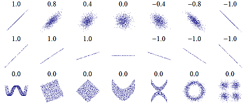

---
title: "STATISTICS indices"
date: "16/05/2017"
output:
  html_document:
    number_sections: no
    toc: yes
    toc_float:
      collapsed: false
      smooth_scroll: false
---	


```{r, echo=FALSE}
library(knitr)
```

<br/>
<br/>

___________________________________________________________________________________________________

# Combinaisons

<br/>

<div style="text-align:center;">
<embed src="pictures_tutorials/example_combinaisons.pdf" width='800' height='400' allowfullscreen webkitallowfullscreen></embed>
</div>

<br/>


___________________________________________________________________________________________________

# Correlations

<br/>

### Correlation between points

- **Pearson correlation :** test linearity

```{r, echo=FALSE, fig.align='center', out.width='400px', fig.retina=1}
include_graphics("pictures_tutorials/example_pearson-correlation.jpg")
```
<br/>
  
- **Spearman correlation :** test monotony

```{r, echo=FALSE, fig.align='center', out.width='400px', fig.retina=1}

```

<br/>


### Correlation between matrices

- **Mantel test**
  - Correlation between 2 distance matrices (e.g. : community distance matrix & environmental matrix)
  - Significance through permutations of rows and columns  
  - Significance of the observed correlation = proportion of such permutations that lead to a higher correlation coefficient

<br/>

- **Partial Mantel test**
  - Correlation between 2 matrices

<br/>

- **Mantel correlogram**
  - Correlation between 2 matrices, by measuring the correlation between each class of distances
  <br/> (Mantel test on each distance class)

<br/>


```R
## Mantel's permutation test for similarity of two matrices
## 1. Permutes the rows and columns of the two matrices randomly
## 2. Calculates a Z-statistic =
##    sum of the pairwise product of the lower triangles
##    of the permuted matrices, for each permutation of rows and columns
## 3. Compares the permuted distribution with the Z-statistic observed
library(ape)
mantel.test(mat1,mat2)

## If only 1 variable :
##    calculates the simple Mantel r
## If more than 1 variable :
##    calculates partial Mantel r by permuting one of the original dissimilarity matrices
library(ecodist)
mantel(mat2 ~ mat1)

## Matrix correlation between two dissimilarity matrices
## Partial matrix correlation between three dissimilarity matrices
##    (significance through permutation of the first matrix)
library(vegan)
mantel(mat1,mat2)
mantel.partial(mat1,mat2,mat3)
```

<br/>


___________________________________________________________________________________________________

# Model evaluation

<br/>

### $R^2$ (1989 : Cox & Snell)

- Mesure la force de l’association (la taille d’effet) et fournit un indice de l’ajustement au modèle.
- Représente une **estimation de la variance expliquée par le modèle**.
- Plus la valeur est élevée, plus la probabilité prédite par le modèle s’approche de la valeur observée.
- MAIS n’atteint jamais le maximum théorique de 1 et varie en fonction de la taille de l’échantillon.

<br/>

### $R^2$ (1991 : Nagelkerke)

Modification du $R^2$ de Cox & Snell pour obtenir une valeur théorique plus proche de 1.

<br/>

- <u>Package `fmsb`, function `NagelkerkeR2` :</u>

\begin{align}
R^2_{fmsb} &=& \frac{1 - e^{\frac{dev - null}{n}}}{1 - e^{\frac{- null}{n}}}
\end{align}

- <u>[RLeca](http://rleca.pbworks.com/w/page/5469696/Scripts) functions :</u>

\begin{align}
R^2_{normal} &=& 1 - \left[ \frac{e^{\frac{- null}{2}}}{e^{\frac{- dev}{2}}} \right]^{2/n} \\ \\
R^2_{rescaled} &=& \frac{R^2_{normal}}{1 - \left( e^{\frac{- null}{n}} \right)^{2/n}} \\ \\
R^2_{adjusted} &=& 1 - \left( \frac{n-1}{n-p} \right)\cdot(1 - R^2_{normal}) \\ \\
R^2_{adjusted\text{, }rescaled} &=& 1 - \left( \frac{n-1}{n-p} \right)\cdot(1 - R^2_{rescaled})
\end{align}

<br/>

with :

- $n$ = number of observations
- $p$ = number of predictors
- $dev$ = model deviance
- $null$ = model null deviance

<br/>

### Area Under Curve (AUC)

- <u>Package `Hmisc`, function `somers2` :</u>

\begin{align}
AUC_{Hmisc} &=& \frac{\overline{\text{rank }_1} - \frac{n_1 + 1}{2}}{n - n_1}
\end{align}

- <u>Package `PresenceAbsence`, function `AUC` :</u>

\begin{align}
AUC_{PresenceAbsence} &=& \frac{n_0 \cdot n_1 + n_0 \cdot \frac{n_0 + 1}{2} - \Sigma \text{ rank }_0}{n_0 \cdot n_1}
\end{align}

<br/>

with :

- $n$ = number of observations
- $n_0$ = number of observed absences
- $n_1$ = number of observed presences
- $\text{rank }_0$ = rank of predictions whose observed values = 0
- $\overline{\text{rank }_1}$ = mean rank of predictions whose observed values = 1

<br/>

### Boyce index (Hilzer, 2006)

Presence-only data. Spearman correlation

- **Predicted to expected ratio :**
  - predicted = proportion de points d'évaluation qui tombent dans chaque classe
  <br/> (axis = habitat suitability, probabilité de présence, entre 0 et 1 par exemple)(juste les pixels d'évaluation)
  - expected = proportion de l'espace qui tombe dans chaque classe (espace = tous les pixels prédits)

- Attendu que le ratio soit inférieur à 1 pour les classes proche de 0 et supérieur pour les classes proches de 1, puisque nos données d'évaluation sont des présences, donc on devrait être biaisé vers la droite de l'axe
<br/> -> test de spearman là dessus

<br/>

<div style="text-align:center;">
<embed src="pictures_tutorials/example_boyce-index.pdf" width='800' height='600' allowfullscreen webkitallowfullscreen></embed>
</div>

<br/>


___________________________________________________________________________________________________

# Variance

<br/>

### Importance of variables

<br/>

<div style="text-align:center;">
<embed src="pictures_tutorials/example_importance-variables.pdf" width='800' height='600' allowfullscreen webkitallowfullscreen></embed>
</div>


<br/>

### VIF (Variance Inflation Factor)

- Detects **multi-collinearity** (correlation between predictors) in regression analysis.
- Estimates how much the variance of a regression coefficient is inflated due to multi-collinearity in the model.
- *Quotient of the variance in a model with multiple terms by the variance of a model with one term $i$ alone.*

\begin{align}
VIF_i &=& \frac{1}{1 - R^2_i}
\end{align}

Ranges from 1 upwards :

  - The numerical value for VIF tells you (in decimal form) what percentage the variance (i.e. the standard error squared) is inflated for each coefficient.
  - *For example, a VIF of 1.9 tells you that the variance of a particular coefficient is 90% bigger than what you would expect if there was no multi-collinearity — if there was no correlation with other predictors.*
    - 1 = not correlated
    - Between 1 and 5 = moderately correlated
    - Greater than 5 = highly correlated


<br/>

### Variance partitioning

- **Formule du crible / Poincaré :** $V_n = V \left( U_{i=1}^n A_i \right)$

<br/>

<u>[RLeca](http://rleca.pbworks.com/w/page/5469696/Scripts) generalization :</u>

- **Transcription de la formule Poincaré :** <br/> *somme de toutes les variances des combinaisons à j éléments impairs parmi n, <br/> moins la somme de toutes les variances des combinaisons à k éléments impairs parmi n*

\begin{equation}
V_{n} = \Sigma_{j = 1, 3, ...}^n \left( \Sigma_{c = C_{n}^j} V_{(c)} \right) - \Sigma_{k = 2, 4, ...}^n \left( \Sigma_{d = C_{n}^k} V_{(d)} \right)
\end{equation}

- **Formule récursive :** 

\begin{equation}
V_{C_{n}^i, n} = V_{C_{n}^i, n-1} - V_{C_{n}^{i+1}, n}
\end{equation}


<br/>

with :

- $n$ = number of predictors
- $i$ = predictor index
- $C_{n}^j$ = combinaison à j élements parmi n
- $V$ = variance (Nagelkerke $R^2_{adjusted, rescaled}$)

<br/>


___________________________________________________________________________________________________


