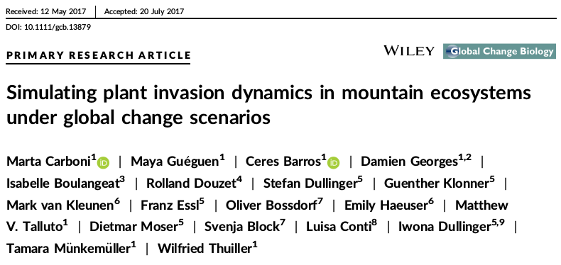
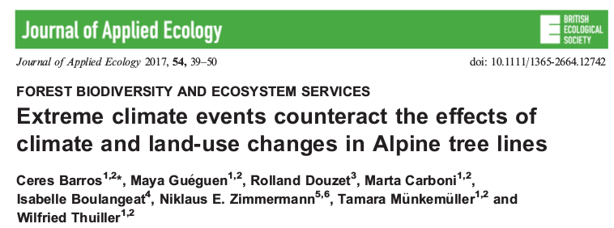

---
output:
  html_document:
    number_sections: no
    toc: yes
    toc_float:
      collapsed: false
      smooth_scroll: false
---	

  

## [2020]()

 

<!-- <a href="papers/Thuiller_2017_Diversity_Distributions.pdf" class="download" title="Download as PDF"> -->
<!--  -->
<!-- </a> -->

 

- Capblancq, T. , Morin, X. , **Guéguen, M.** , Renaud, J. , Lobreaux, S. and Bazin, E. (2020). *Climate associated genetic variation in Fagus sylvatica and potential responses to climate change in the French Alps.* Journal of Evolutionary Biology. 33. https://doi.org/10.1111/jeb.13610
- Sherpa, S. , Renaud, J. , **Guéguen, M.** , Besnard, G. , Mouyon, L. , Rey, D. and Després, L. (2020). *Landscape does matter: Disentangling founder effects from natural and human-aided post-introduction dispersal during an ongoing biological invasion.* Journal of Animal Ecology. https://doi.org/10.1111/1365-2656.13284

 

## [2019]()

 

<!-- <a href="papers/Thuiller_2017_Diversity_Distributions.pdf" class="download" title="Download as PDF"> -->
<!--  -->
<!-- </a> -->

 

- Cerasoli, F. , Thuiller, W. , **Guéguen, M.** , Renaud, J. , D'Alessandro, P. and Biondi, M. (2019). *The role of climate and biotic factors in shaping current distributions and potential future shifts of European Neocrepidodera (Coleoptera, Chrysomelidae).* Insect Conservation and Diversity. https://doi.org/10.1111/icad.12376
- Dufour, P. , Descamps, S. , Chantepie, S. , Renaud, J. , **Guéguen, M.** , Schiffers, K. , Thuiller, W. and Lavergne, S. (2019). *Reconstructing the geographic and climatic origins of long‐distance bird migrations.* Journal of Biogeography. https://doi.org/10.1111/jbi.13700
- Menchetti, M. , **Guéguen, M.** and Talavera, G. (2019). Spatio-temporal ecological niche modelling of multigenerational insect migrations. Proceedings of the Royal Society B: Biological Sciences. 286. 20191583. https://doi.org/10.1098/rspb.2019.1583
- Ondo, I. , Thuiller, W. , **Guéguen, M.** and Pironon, S. (2019). *A new R application for Modelling Species Distribution.* https://doi.org/10.13140/RG.2.2.23431.83363
- Sherpa, S. , **Guéguen, M.** , Renaud, J. , Blum, M. , Gaude, T. , Laporte, F. , Akiner, M. M. , Alten, B. , Aranda, C. , Barré-Cardi, H. , Bellini, R. , Paulis, M. , Chen, X-G. , Eritja, R. , Flacio, E. , Foxi, C. , Ishak, I. , Kalan, K. , Kasai, S. and Després, L. (2019). *Predicting the success of an invader: Niche shift versus niche conservatism.* Ecology and Evolution. https://doi.org/10.1002/ece3.5734
- Thuiller, W. , **Guéguen, M.** , Renaud, J. , Karger, D. N. and Zimmermann, N. (2019). *Uncertainty in ensembles of global biodiversity scenarios.* Nature Communications. 10. https://doi.org/10.1038/s41467-019-09519-w

 

## [2018]()

 

<!-- <a href="papers/Thuiller_2017_Diversity_Distributions.pdf" class="download" title="Download as PDF"> -->
<!--  -->
<!-- </a> -->

 

- Kim, H. , Rosa, I. ,  Alkemade, R. , Leadley, P. , Hurtt, G. , Popp, A. , Vuuren, D. , Anthoni, P. , Arneth, A. , Baisero, D. , Caton, E. , Chaplin-Kramer, R. , Chini, L , De Palma, A. , Di Fulvio, F. , Di Marco, M. , Espinoza, F. , Ferrier, S. and Fujimori, S. (2018). *A protocol for an intercomparison of biodiversity and ecosystem services models using harmonized land-use and climate scenarios.* Geoscientific Model Development. 11. 4537-4562. https://doi.org/10.5194/gmd-11-4537-2018
- Roy, J. , Bonneville, J-M. , Saccone, P. , Ibañez, S. , Albert, C. , Boleda, M. , **Guéguen, M.** , Ohlmann, M. , Rioux, D. , Clement, J-C. , Lavergne, S. and Geremia, R. (2018). *Differences in the fungal communities nursed by two genetic groups of the alpine cushion plant, Silene acaulis: XXXX.* Ecology and Evolution. 8. https://doi.org/10.1002/ece3.4606

 

## [2017]()

 

 

- Barros, C. , **Guéguen, M.** , Douzet, R. , Carboni, M. , Boulangeat, I. , Zimmermann, N. E., Münkemüller, T. , Thuiller, W. and Mori, A. (2017). *Extreme climate events counteract the effects of climate and land‐use changes in Alpine tree lines.* J Appl Ecol, 54: 39-50. https://doi.org/10.1111/1365-2664.12742
- Carboni M, **Guéguen M**, Barros C, et al. (2017). *Simulating plant invasion dynamics in mountain ecosystems under global change scenarios.* Glob Change Biol. 2018;24:e289–e302. https://doi.org/10.1111/gcb.13879
- Mazel, F., Wüest, R., **Guéguen, M.**, Renaud, J., Ficetola, G. F., Lavergne, S. & Thuiller, W. (2017). *The Geography of Ecological Niche Evolution in Mammals.* Current Biology. 27. https://doi.org/10.1016/j.cub.2017.03.046. 
- Thuiller W, **Guéguen M**, Bison M, et al. (2017). *Combining point‐process and landscape vegetation models to predict large herbivore distributions in space and time—A case study of Rupicapra rupicapra.* Divers Distrib. 2018;24:352–362. https://doi.org/10.1111/ddi.12684

 

## [2015]()

 

 

- Thuiller, W. , Pollock, L. J., **Guéguen, M.** , Münkemüller, T. and Cornell, H. (2015). *From species distributions to meta‐communities.* Ecol Lett, 18: 1321-1328. https://doi.org/10.1111/ele.12526

 

## [2014]()

 

 

- Thuiller, W. , **Guéguen, M.** , Georges, D. , Bonet, R. , Chalmandrier, L. , Garraud, L. , Renaud, J. , Roquet, C. , Van Es, J. , Zimmermann, N. E. and Lavergne, S. (2014). *Are different facets of plant diversity well protected against climate and land cover changes? A test study in the French Alps.* Ecography, 37: 1254-1266. https://doi.org/10.1111/ecog.00670

